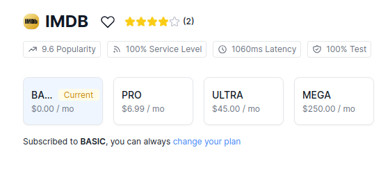

# React II week project I 

## Dev

Install the packages with node. 

```shell
npm install
```

Change the API KEY in a new local configuration file by creating a copy of `.env` and change the values


```shell
cp .env .env.local
```

or


```shell
echo -e "APIKEY=<your api token for IMDB movies>\nTOKEN=<token api for omdb>" > .env.local
```

this project uses [RapidAPi](https://rapidapi.com), specifically [IMDB API](https://rapidapi.com/DataCrawler/api/imdb188). Login in RapidAPI and subscribe to the free plan for IMDB, then put the api-key-token in the above command :)



The second token belongs to [OMDB](http://www.omdbapi.com), just login and request a free api token.


### Run

```shell
npm run dev
```